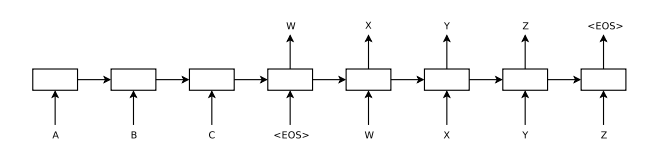

# Optimizing the Seq2Seq Bottleneck

## Overview

In a standard Sequence-to-Sequence (Seq2Seq) neural machine translation model, the encoder must compress the entire source sentence into a single fixed-length context vector. This can create a **bottleneck** for long or complex sentences, causing critical information to be lost. The goal of this competition is to propose **intuitive optimizations** that address this bottleneck.

## The Problem

- **Current Approach**  
  - A Seq2Seq encoder reads the entire source sentence and produces a single, fixed-size context vector.  
  - The decoder then generates the target sentence from this single vector.  

- **Issue**  
  - For longer or more complex sentences, crucial details can be lost during compression.  
  - Performance degrades when the source text exceeds the length or complexity of examples seen in training.

## Your Task

1. **Propose a High-Level Solution**  
   - Explain **how** you would modify or enhance the Seq2Seq architecture to mitigate the bottleneck.  
   - No need to implement or train a model—focus on the conceptual approach.  

2. **(Optional) Pseudo-Code**  
   - If you wish, provide a brief sketch or pseudo-code showing how your method would integrate into a Seq2Seq pipeline.

## What to Submit

- A **short explanation** describing your solution to the bottleneck issue.  
- Optionally, **pseudo-code** that outlines how your approach might be integrated into a Seq2Seq model.

## Evaluation

Submissions will be judged on:
1. **Clarity** – How well you describe the bottleneck and your proposed solution.  
2. **Feasibility** – The extent to which your idea can be reasonably implemented (even though you’re not coding it).  
3. **Innovation** – Creativity in addressing the bottleneck, especially for longer or more complex sentences.

We look forward to your **insightful** and **creative** solutions for optimizing Seq2Seq models!
